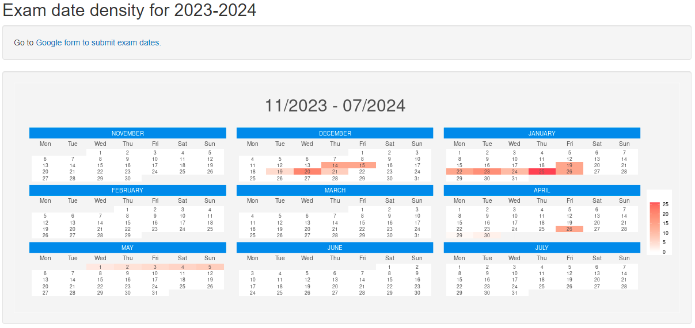

# Exam Calendar

This shiny application reads data from submitted forms of exam dates and displays calendar heatmap ([calendR package](https://github.com/R-CoderDotCom/calendR)). This provides a simple tool to get an overview of high density exam-periods allowing other events to be planned accordingly.

[Link to Shiny app](https://e1uvw9-alban-laus.shinyapps.io/Shiny_sheets/)
 

